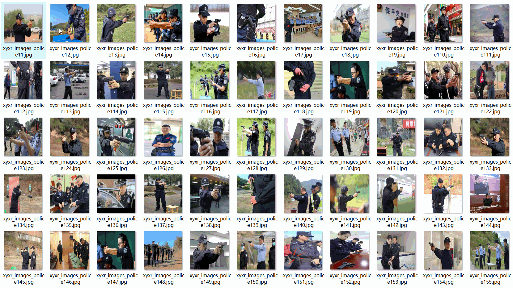

# Police Officer Detection Dataset 2105 images VOC+YOLO format

The Police Officer Detection dataset contains 2105 images in VOC+YOLO format.

The dataset is formatted as VOC with additional YOLO labels.

It includes three folders within the zip file, each containing:
- JPEGImages for storing the image files
- Annotations for holding the XML files
- labels for storing the text files

The total number of JPEGImages in the JPEGImages folder is 2105.

The total number of XML files in the Annotations folder is also 2105.

The total number of text files in the labels folder is 2105.

There are a single label category: "police".

The box count for the "police" category (as per YOLO format) is 4784.

The total box count is 4784.

The image resolution is clear.

The images have not been enhanced.

The GitHub repository location is datasets_sl.

The label shape is a rectangular bounding box, used for target detection recognition.

Important Note: No specific note for zero-shot learning.

Special Disclaimer: The dataset does not guarantee the accuracy or precision of any trained models or weight files and only provides accurate and reasonable annotations.

## Images

---

Here is a pay link on Stripe (https://buy.stripe.com/3cs8yP7sY87d0vu9AB). Please contact me lonlonago@foxmail.com after funding $89, and I will send you a complete data files, thank you!

